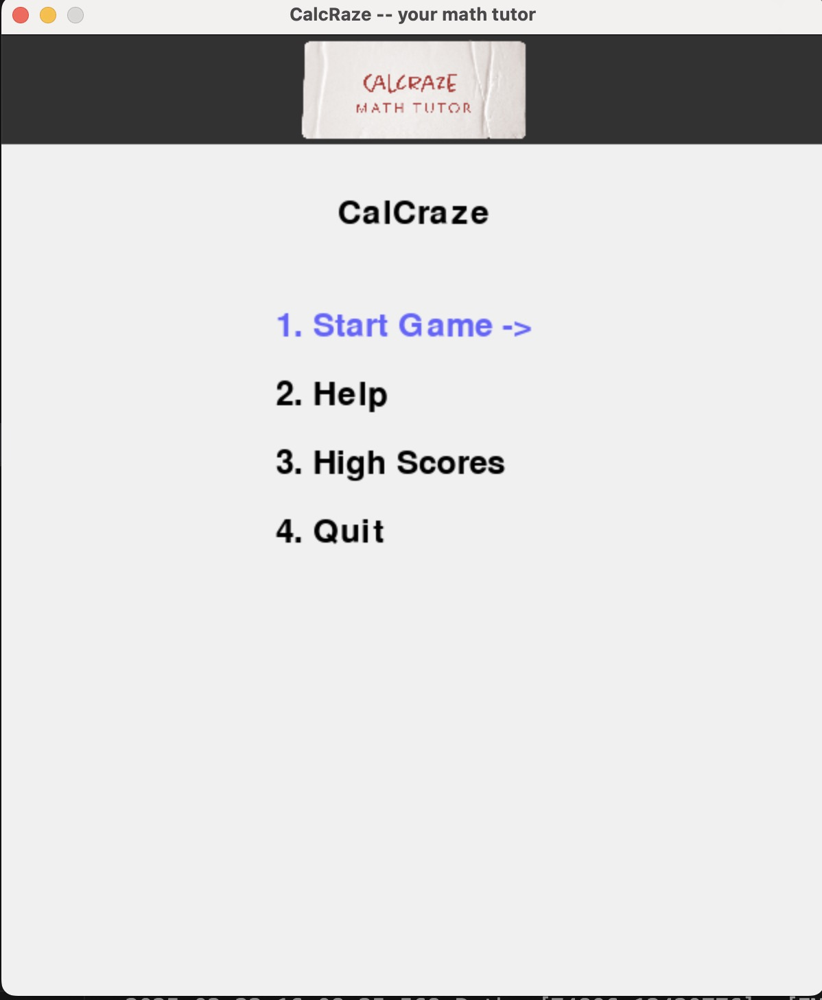
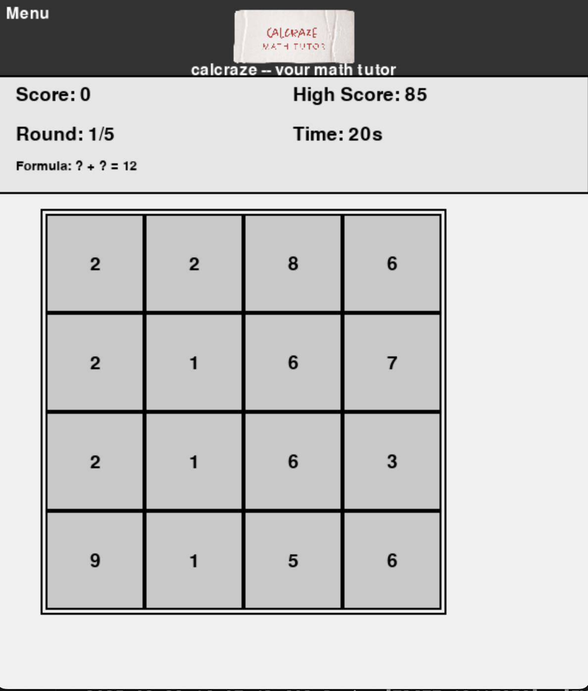

# 🧠 CalCraze - Formula Fill Math Game

**CalCraze** is an engaging and educational mental math game designed to challenge your brain with quick calculations and formula filling tasks. Whether you're looking to sharpen your math skills, enjoy a fun brain workout, or compete for the highest score, CalCraze offers an exciting experience for players of all ages.

## 🎮 Features

1. **Interactive Gameplay:** Fill in the blanks of randomly generated math formulas using numbers from a grid.
2. **Dynamic Formula Update:** The formula updates in real-time as you select numbers.
3. **Intelligent Filtering:** Only formulas with integer results are generated, avoiding decimals.
4. **Multiple Difficulty Levels:** Choose from Beginner, Intermediate, and Advanced modes.
5. **User-Friendly UI:** Smooth animations, hover effects, and intuitive controls.
6. **Multi-Language Support:** English and Traditional Chinese, with automatic translation for new languages.
7. **Undo Function:** Easily retract previous inputs using Backspace.
8. **High Score Tracking:** Challenge yourself to beat your personal best.
9. **Pause and Resume:** Take breaks without losing progress.
10. **Help Menu:** In-game tutorial with scrollable instructions.

## 🖥️ Installation

### 🐍 Prerequisites
Ensure you have Python 3.11+ and `pygame` installed.
Install the following in your environment:
```bash
pip install pygame googletrans==4.0.0-rc1
```

1. **Clone the Repository:**
   ```bash
   git clone https://github.com/yourusername/CalCraze.git
   cd CalCraze
   ```

2. **Install Dependencies:**
   ```bash
   python3.11 -m venv venv
   source venv/bin/activate
   pip install pygame googletrans
   ```

3. **Run the Game:**
   ```bash
   python3 calcraze.py
   ```

## ⚙️ Configuration
CalCraze stores settings in `config/settings.json` and language packs in `config/languages.json`. You can modify:

- Window size
- Grid size
- Difficulty parameters (min/max numbers, rounds, and time limits)
- Custom fonts (ensure system support for non-Latin characters)

## 🎲 How to Play
1. **Start the Game:** Select difficulty from the main menu.
2. **Fill the Formula:** Choose numbers from the grid to replace placeholders (A, B, C).
3. **Submit Your Answer:** Press Enter when ready.
4. **Score Points:** Correct answers increase your score, while incorrect ones deduct points.
5. **Complete Rounds:** Each game consists of multiple rounds. Finish them all to win!

## 🕹️ Controls
- **Arrow Keys:** Navigate menu options.
- **Enter:** Confirm selection.
- **Backspace:** Undo the last number selection.
- **Ctrl+H / Cmd+H:** Toggle help menu.
- **Esc:** Return to the previous menu.

## 🖌️ Customization
- **Logo:** Add a `logo.png` in the assets folder to display your custom logo in the menu.
- **Languages:** Add translations in `config/languages.json`. Missing keys are auto-filled via Google Translate.
- **Difficulty:** Adjust `settings.json` to customize rounds, time limits, and number ranges.

## screenshots
<!-- add screenshots from /screenshots/* -->
## 📸 Screenshots

Here are some screenshots of CalCraze in action:


*Main Menu*


*Gameplay*

## 🚀 Roadmap
- Add multiplayer mode (local and online).
- Support more languages.
- Expand formula complexity for advanced users.
- Implement leaderboard and user profiles.

## 🤝 Contributing
Contributions are welcome! Please follow these steps:

1. Fork the repo and create a new branch.
2. Make your changes and run tests.
3. Submit a pull request with clear commit messages.

## 📝 License
This project is licensed under the MIT License.

## 🧩 Acknowledgments
- **pygame:** For powering the game engine.
- **Google Translate API:** For automatic language translation.
- **Open Source Community:** For inspiring creativity and innovation.

🌟 Enjoy the thrill of mental math with CalCraze! Test your skills, challenge your friends, and become a formula master! 🌟